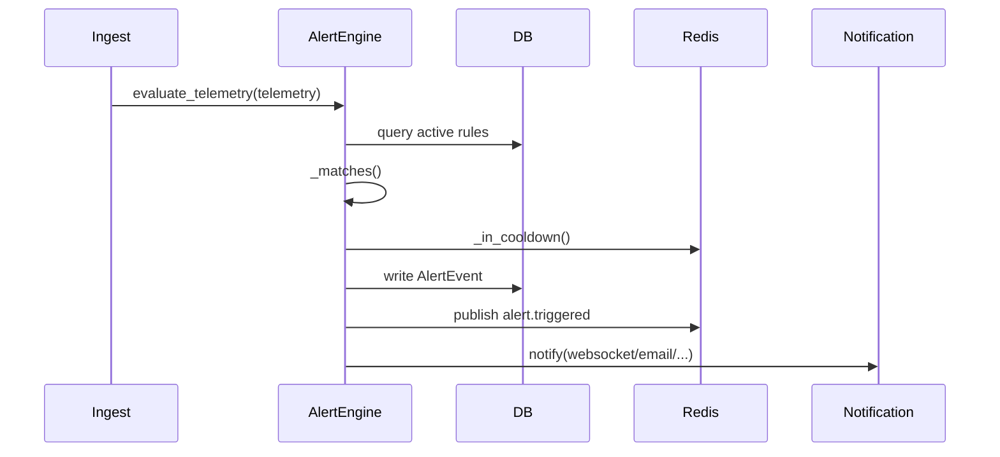

# Alert Engine — Design and Operation

Purpose

Explain how alert rules are evaluated, events are generated and delivered. This document maps code in `app/services/alert_engine.py` and related repositories.

Components

- `AlertRuleRepository` and `AlertEventRepository` (persistence)
- `app.services.alert_engine.AlertEngine` — evaluates telemetry against `AlertRule` definitions
- `app.services.notification_service.NotificationService` — queues notifications via Celery
- `app.services.event_bus` — publishes `alerts` channel messages to Redis for WebSocket delivery

Evaluation flow

- Input: telemetry dict (from `IngestService.persist_event`)
- For each active rule (`rule_repo.list_active()`):
  - If telemetry has the metric, compare value using `_matches(operator, value, threshold)`
  - If matched and not in cooldown (`_in_cooldown` uses Redis), create `AlertEvent`, persist and publish to Redis and notify via `NotificationService`
  - If in cooldown: increment `cc_alerts_cooldown_skipped_total`

Mermaid flow

Cooldown and dedupe

- Cooldown is implemented via Redis key `alert:cooldown:{tenant_id}:{rule_id}` set with TTL equal to rule.cooldown_seconds.
- The engine will skip creating alerts while the key exists, reducing noise.

Instrumentation

- Metrics: `cc_alerts_triggered_total`, `cc_alerts_cooldown_skipped_total` are incremented for visibility and alert noise analysis.

Why this document matters

Alerting is business-critical. This doc ensures operators and engineers understand where rules live, how to tune cooldowns, and how notifications are delivered.

Which modules this documents

- `app.services.alert_engine`, `app.repositories.alerts`, `app.services.notification_service`, `app.services.event_bus`.
