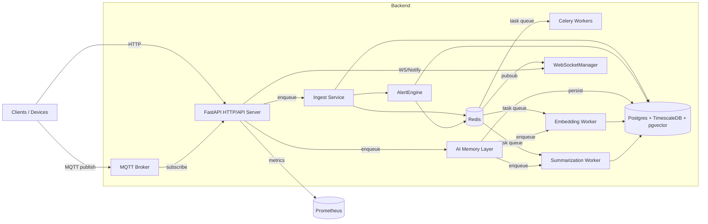

# Architecture — ConnectedCare+ Backend

STATUS: IMPLEMENTED
Last verified against repository state: 2026-05-09

Purpose

This document describes the high-level architecture of the ConnectedCare+ backend and how components interact at runtime. It is generated from the existing code in `app/` and `alembic/` and focuses on operational integration points.

High-level components

- **FastAPI HTTP API** (`app.main`, `app.api.v1.*`) — exposes REST and WebSocket endpoints
- **SQLAlchemy models** (`app.models.*`) persisted in PostgreSQL / TimescaleDB with pgvector extension
- **Alembic migrations** (`alembic/versions`) manage schema (13 migrations, including AI memory)
- **MQTT ingestion** (`app.services.mqtt_service`) receives device telemetry
- **Ingest pipeline** (`app.services.ingest_service`) dedupes, persists, and publishes events
- **Alert engine** (`app.services.alert_engine`) evaluates telemetry and writes alert events
- **Event bus** (`app.services.event_bus`) uses Redis pub/sub for cross-process notifications
- **WebSocket layer** (`app.api.v1.ws_alerts`) broadcasts alerts to connected clients
- **AI Memory System** (`app.models.ai_memory`, `app.repositories.ai_memory`, `app.workers`) — stores conversation context, embeddings, and summaries
  - ORM models: `AIConversation`, `AIMessage`, `AIMemoryChunk`, `AIMemoryEmbedding`, `AIMemorySummary`, `AIContextWindow`, `AIMemoryLink`
  - Repository: thin data access layer with tenant isolation and semantic search via pgvector
  - Workers: embedding generation (`app.workers.embedding_worker`) and summarization (`app.workers.summarization_worker`) tasks
  - Task service: `app.services.ai_memory_task_service` for priority-based task enqueuing
- **Celery** (`app.core.celery_app`) runs async background jobs (embeddings, summaries, notifications)
  - Queue topology: 5 queues (embedding, summarization, memory, retry, dead_letter)
  - Exponential backoff retry (5 retries, 1s → 16s backoff)
- **Observability**: JSON logging (`app/core/logging.py`) & Prometheus metrics (`app/core/metrics.py`)

Mermaid deployment diagram

Request lifecycle (summary)

1. Client sends HTTP request to FastAPI. `TenantContextMiddleware` extracts tenant (from JWT) and attaches to `request.state`.
2. `LoggingMiddleware` sets `request_id`, `trace_id`, and populates contextvars for structured logging.
3. `MetricsMiddleware` records request start; response start triggers `http_requests_total` and `http_request_duration_seconds` observation.
4. Router handler executes (may call services, DB, Celery).
5. Response completes; middleware appends `X-Request-ID` header.

Folder-level component map

- `app/api/v1` — routers for Auth (`auth.py`), Tenants (`tenants.py`), RBAC (`rbac.py`), Healthcare (`healthcare.py`), Telemetry (`telemetry.py`), Alerts (`alerts.py`), Devices (`devices.py`), Vitals (`vitals.py`), WebSockets (`ws_alerts.py`)
- `app/services` — business logic layers
  - `ingest_service.py` — device event deduplication and persistence
  - `alert_engine.py` — alert rule evaluation and event generation
  - `mqtt_service.py` — MQTT client lifecycle management
  - `notification_service.py` — notification delivery
  - `ai_memory_task_service.py` — high-level API for enqueuing AI memory tasks with priority routing
  - `auth_service.py`, `rbac.py`, `tenant.py`, `healthcare.py`, `vitals_service.py`, `device_service.py`, `event_bus.py`
- `app/models` — SQLAlchemy ORM models mapped to 25 database tables
  - Core: `tenant.py`, `user.py`, `auth.py`, `device.py`
  - Healthcare: `healthcare.py` (Elder, Caregiver, Doctor, FamilyMember, MedicalProfile, CarePlan, etc.)
  - Telemetry: `streams.py` (VitalStreamEvent, DeviceTelemetry hypertable, VitalThreshold, VitalAnomaly, DeviceHeartbeat, IngestionFailureLog)
  - Alerts: `alerts.py`, `alert.py`
  - RBAC: `rbac.py` (Permission, Role, RolePermission, UserRole)
  - AI Memory: `ai_memory.py` (AIConversation, AIMessage, AIMemoryChunk, AIMemoryEmbedding, AIMemorySummary, AIContextWindow, AIMemoryLink)
- `app/repositories` — thin data access layers with tenant isolation and soft delete support
  - `auth.py`, `alerts.py`, `healthcare.py`, `rbac.py`, `streams.py`, `tenant.py`, `ai_memory.py`
- `app/workers` — Celery task workers
  - `embedding_worker.py` — generates and stores vector embeddings (1536 dimensions) for AI memory chunks
  - `summarization_worker.py` — compresses conversation windows into summaries
  - `__init__.py` — queue topology (5 queues: embedding, summarization, memory, retry, dead_letter) and base task classes
- `app/core` — infrastructure
  - `logging.py` — structured JSON logging with contextvars (request_id, tenant_id, user_id, trace_id)
  - `metrics.py` — Prometheus counters, histograms, gauges (including 6 AI memory metrics)
  - `celery_app.py` — Celery factory, signal instrumentation, task lifecycle hooks
  - `config.py` — settings from environment
- `app/middleware` — HTTP middleware stack
  - `tenant_context.py` — extracts and validates tenant from JWT
  - `logging_middleware.py` — request/response lifecycle logging with structured context
  - `metrics_middleware.py` — Prometheus request/response metrics collection
  - `request_id.py` — generates correlation IDs
- `app/db` — database infrastructure
  - `base.py` — SQLAlchemy Base and mixins (UUIDPrimaryKeyMixin, TimestampMixin)
  - `session.py` — async SQLAlchemy session factory
  - `async_session.py` — session management utilities
- `app/dependencies` — FastAPI dependency injection
  - `authorization.py` — tenant and RBAC checks

Startup lifecycle

- `app/main.py` constructs `FastAPI` with `lifespan` that starts `mqtt_manager` and registers middleware.
- `configure_logging()` is called early to set global JSON logging.
- `MetricsMiddleware` is attached for Prometheus metrics collection.
- Celery workers import `app.core.celery_app` which sets up signals to instrument task lifecycle.

Operational relationships

**Telemetry ingestion:**
- MQTT → MQTT client → `IngestService.persist_event()` → `DeviceTelemetry` / `VitalStreamEvent` persisted to TimescaleDB hypertable
- Alert evaluation occurs after persist via `AlertEngine.evaluate_telemetry()`
- Alert events written to DB and published to Redis `alerts` channel; `ws_alerts` listener broadcasts to WebSocket clients
- Notifications delivered asynchronously via Celery workers

**AI Memory lifecycle:**
- Conversation is created via `AIMemoryRepository.create_conversation()` → stored in `ai_conversations` table
- Messages appended to conversation via `append_message()` → immutable ledger in `ai_messages` table
- Chunks extracted from messages/summaries and persisted via `create_chunk()` → `ai_memory_chunks` table
- Embedding generation enqueued via `AIMemoryTaskService.enqueue_embedding_for_chunk()` → sent to `embedding` queue
- EmbeddingWorker retrieves chunk, generates 1536-dim vector via `_generate_embedding_vector()`, stores in `ai_memory_embeddings` via pgvector column
- Semantic search queries chunks via `AIMemoryRepository.semantic_search()` using pgvector cosine distance (IVFFlat index)
- Summarization enqueued via `enqueue_summary_for_window()` → sent to `summarization` queue
- SummarizationWorker compresses messages in time window, stores summary in `ai_memory_summaries` with hash-based deduplication
- All AI memory operations maintain tenant isolation and idempotency via content hashing

**Queue topology:**
- Embedding queue (priority=10, TTL=24h max) → EmbeddingTask processes chunks → metrics on success/failure
- Summarization queue (priority=8, TTL=24h max) → SummarizationTask processes windows → metrics on success/failure
- Memory queue (priority=5) → batching tasks (enqueue_conversation_embeddings, schedule_periodic_summarization)
- Retry queue (priority=1, TTL=24h) → failed tasks rerouted here with exponential backoff (1s → 2s → 4s → 8s → 16s)
- Dead-letter queue (TTL=7d) → tasks exceeding max retries (5) for manual inspection

Why this document matters

It provides a single-page operational view for architects and on-call engineers to understand component boundaries and data flows. It references the exact modules implementing each responsibility.

Which modules this documents

- **HTTP/Request layer:** `app.main`, `app.api.v1.*`, `app.middleware.*`
- **Data access:** `app.models.*`, `app.repositories.*`, `app.db.*`
- **Business logic:** `app.services.*`
- **Async processing:** `app.core.celery_app`, `app.workers.*`
- **AI Memory system:** `app.models.ai_memory`, `app.repositories.ai_memory`, `app.workers.embedding_worker`, `app.workers.summarization_worker`, `app.services.ai_memory_task_service`
- **Infrastructure:** `app.core.logging`, `app.core.metrics`, `app.core.config`, `app.dependencies.*`
