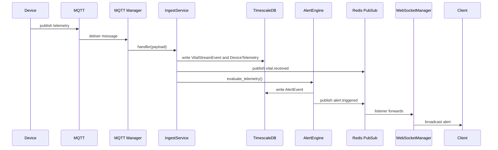

# Stream Pipeline — Telemetry Ingestion

Purpose

End-to-end explanation of how device telemetry flows from MQTT through ingestion into TimescaleDB and then into the AlertEngine.

End-to-end flow (components)

- MQTT broker (devices publish telemetry)
- `app.services.mqtt_service.mqtt_manager` subscribes and dispatches messages to handlers
- `app.services.ingest_service.IngestService.persist_event` performs dedupe, saves `VitalStreamEvent` and `DeviceTelemetry`
- `app.services.alert_engine.AlertEngine.evaluate_telemetry` checks rules and publishes alerts
- `app.services.event_bus.event_bus` publishes events to Redis; `app.api.v1.ws_alerts` listens and broadcasts to WebSocket clients

Mermaid sequence diagram

Deduplication

- Deduplication is handled in the ingest path and repository layer; Redis-backed state is used when available, and ingest failures are persisted for later inspection.

Timescale hypertable

- `device_telemetry` is stored as a hypertable to support high write rates and efficient time-range queries.

Failure handling

- On ingest failures, `IngestService.log_failure` persists a record to `ingestion_failure_logs` and logs the error. Notifications and retries are orchestrated via Celery tasks if configured.

Instrumentation

- `app/core/metrics.py` instruments ingest events (`cc_ingest_events_total`, `cc_ingest_duplicates_total`), MQTT (`cc_mqtt_messages_total`, `cc_mqtt_publish_failures_total`), and alerts (`cc_alerts_triggered_total`, `cc_alerts_cooldown_skipped_total`).

Why this document matters

Telemetry is the primary data pipeline — this doc explains the exact code path and failure modes so operators can debug ingestion problems quickly.

Which modules this documents

- `app.services.mqtt_service`, `app.services.ingest_service`, `app.models.streams`, `app.services.alert_engine`, `app.services.event_bus`, `app.api.v1.ws_alerts`.

## Limitations

- The current implementation is request-path oriented; there is no dedicated stream-processing worker.

## Future Work

- Add stream-specific async processing only if corresponding code is introduced.
